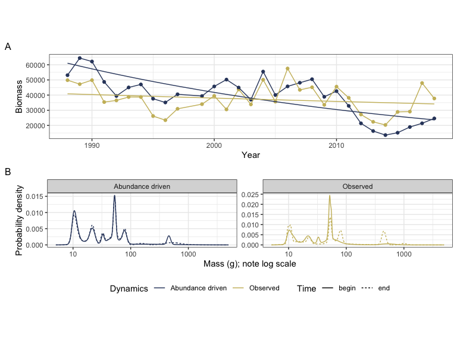
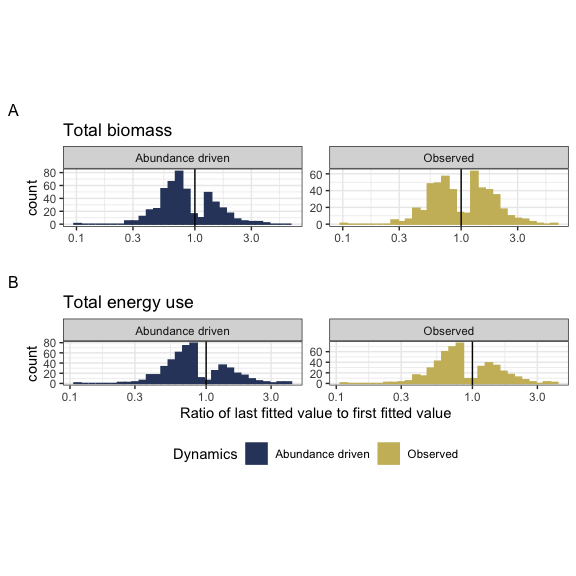
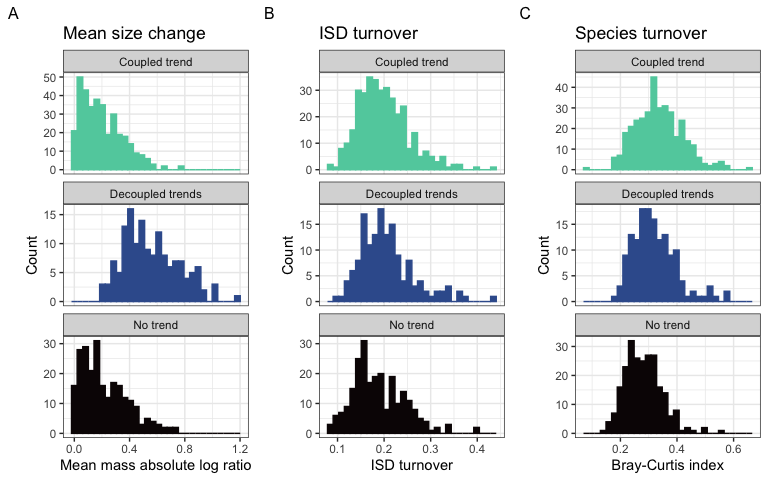

# Figure 1. Abundance-driven vs. observed change

<!-- -->

#### Figure 1.

Illustration of abundance-driven (null model) dynamics as compared to
observed dynamics (A), and the underlying dynamics of the ISD (B) for a
sample route (LINDBROOK, Alberta). **A. Dynamics of total biomass.** The
gold points show the true values for total biomass in each year, and the
blue points show the values for total biomass simulated from a null
model that incorporates change in total abundance, but assumes no change
in the size structure, over time. The smooth lines show the predicted
values from a Gamma (log-link) linear model of the form `total_biomass ~
year * Dynamics`. For this route, change in the individual size
distribution has decoupled the dynamics of biomass from those that would
occur due only to changes in abundance. The slope for abundance-driven
dynamics is significantly more negative than for the observed dynamics
(interaction term p = 0.0013). **B. Underlying changes in the ISD.** The
individual size distributions for the first 5 years (solid lines) and
last 5 years (dashed lines) of the timeseries. The x-axis is body size
(as mass in grams; note log scale) and the y-axis is probability density
from a Gaussian mixture model fit to a vector of simulated individual
masses for all individuals observed in the years in questions,
standardized to sum to 1. For the abundance-driven (blue) scenario,
individuals’ species identities (which determine their body size
estimates) are re-assigned at random weighte by each species’ mean
relative abundance throughout the timeseries, resulting in a consistent
individual size distribution over time. For the observed (gold)
scenario, individuals’ body sizes are estimated based actual species
abundances at each time step. For this route, species composition has
shifted over time and produced different ISDs for the “begin” and “end”
time periods. Specifically, the “end” ISD has peaks at larger body sizes
(ca. 90g and 500g) not present in the “begin” ISD. This redistribution
of density towards larger body sizes results in an overall increase in
body size community wide, which partially offsets declines in total
biomass from those expected given change in abundance alone.

# Figure 2. Directions and magnitudes of change.

<!-- -->

#### Figure 2. Long-term trends in total biomass and energy use

Histograms showing the direction and magnitude of change over time for
the abundance-driven (left) and observed (right) changes in biomass (A)
and energy use (B), for communities with a significant slope and/or
interaction term (for biomass, 500/739 routes; for energy use, 509/739
routes). Change is summarized as the ratio of the fitted value for the
last year in the time series to the fitted value for the first year in
the timeseries from the best-fitting model for that community. Values
greater than 1 (vertical black line) indicate increases in total energy
or biomass over time, and less than 1 indicate decreases. The
abundance-driven dynamics (left) reflect the trends fit for the null
model, while the observed dynamics (right) reflect trends incorporating
both change in total abundance and change in the size structure over
time. For communities with no significant interaction term in the
best-fitting model, the “abundance-driven” and “observed” ratios will be
the same; interaction terms will result in different ratios for
“abundance-driven” and “observed” dynamics.

Among routes with temporal trends, there are qualitatively different
continental-wide patterns in abundance-driven and observed dynamics for
total biomass and total energy use. 70% of trends in abundance-driven
dynamics for energy use are decreasing, and 67% for biomass. However,
for biomass, observed dynamics are balanced evenly between increases
(49% of routes) and decreases (51%) - indicating that changes in the
size structure produce qualitatively different long-term trends for
biomass than would be expected given abundance changes alone. However,
trends for energy use (which scales nonlinearly with biomass) are
dominated by decreases (35% of routes), more closely mirroring the
trends expected given changes in abundance.

# Tables: Model outcomes

<!-- and directions of trends  -->

### Table 1.

| Currency         | Selected model       | Number of routes | Proportion of routes |
| :--------------- | :------------------- | ---------------: | -------------------: |
| Total biomass    | Intercept-only       |              239 |                 0.32 |
| Total biomass    | Trend, not decoupled |              351 |                 0.47 |
| Total biomass    | Decoupled trend      |              149 |                 0.20 |
| Total energy use | Intercept-only       |              230 |                 0.31 |
| Total energy use | Trend, not decoupled |              456 |                 0.62 |
| Total energy use | Decoupled trend      |               53 |                 0.07 |

#### Table 1. Selected models.

Table of the number and proportion of routes whose dynamics for total
biomass and total energy use are best-fit by: a model with no temporal
trend (intercept-only model, `response ~ 1`); a model with a temporal
trend, but no difference in trend between observed and abundance-driven
dynamics (`response ~ timeperiod`); or a model with decoupled temporal
trends for observed and abundance-driven dynamics (`response ~
timeperiod * dynamics`, where `dynamics` is either observed or
abundance-driven/null model).

For 31-32% of routes, models with trends do not outperform simple
intercept-only models. For the remaining routes, in most instances, the
dynamics of biomass and energy use exhibit a temporal trend, but with no
detectable difference in the temporal trends for abundance-driven and
observed dynamics. However, for a substantial minority of routes (20%
overall for biomass, or 30% of routes with a temporal trend; 7% overall
for energy use, or 10% of routes with a temporal trend), there is a
detectable deviation between the trends expected due only to changes in
abundance and the observed dynamics.

### Table 2.

| Currency         | Proportion of increasing abundance-driven trends | Proportion of increasing observed trends | Number of routes with temporal trends |
| :--------------- | -----------------------------------------------: | ---------------------------------------: | ------------------------------------: |
| Total biomass    |                                             0.33 |                                     0.49 |                                   500 |
| Total energy use |                                             0.30 |                                     0.35 |                                   509 |

#### Table 2. Direction of temporal trends in abundance-driven and observed dynamics.

Restricted to the routes exhibiting temporal trends in total biomass and
total energy use, the proportion of trends that are increasing
(specifically, the ratio of the last fitted value to the first fitted
value \> 1) for abundance-driven and observed dynamics. Trends that are
not increasing are decreasing.

Trends in abundance-driven dynamics are dominated by *declines* (67% of
routes for total biomass, and 70% of routes for total energy). Observed
dynamics for biomass differ qualitatively from the abundance-driven
dynamics; observed trends in biomass are evenly divided between
increases and decreases (49% increasing). Observed trends in energy use
more closely mirror abundance-driven trends (65% declines).

# Figure 3. Visualizing decoupling

<!-- -->

#### Figure 3. Decoupling between abundance-driven and observed trends.

Observed change (ratio of last fitted value to first fitted value,
y-axis) in total biomass (left) and total energy use (right) compared to
the change expected only due to changes in total abundance (ratio of
last fitted value to first fitted value, x-axis). Values greater than 1
(dashed horizontal and vertical lines) mark positive (increasing)
trends, while values less than 1 are negative trends. Each point marks
the fitted values from a Gamma log-link generalized linear model of the
form `response ~ year * dynamics` for a given route. This estimates
separate long-term slopes for observed and abundance-driven dynamics.
Points are colored corresponding to the best-fitting model
(intercept-only, or “no trend”; a slope for year but no difference in
slopes between observed and abundance-driven dynamics, or “coupled
trend”, and separate slopes for observed and abundance-driven
dynamics, “decoupled trends”) for each route. Deviations from the 1:1
line (solid black line) reflect changes in the community size structure
that modulate the relationship between total abundance and total biomass
or energy use.

Changes in total biomass and total energy use generally track changes
driven by fluctuations in total abundance, with appreciable scatter
around the 1:1 line. When this translates into a statistically
detectable decoupling between observed and abundance-driven dynamics
(“Decoupled trends”), this is usually in the form of abundance-driven
change being more negative (a steeper decline or a smaller increase)
than observed change in biomass or energy use (a less steep decline or
larger increase), resulting in points falling above and to the left of
the 1:1 line. This occurs more strongly and frequently for biomass than
for energy use.

# Figure 4. How change in community structure translates into decoupling

<!-- -->

#### Figure 4. Histograms of change in community structure for routes showing no trends, coupled, and decoupled trends in abundance-driven and observed dynamics.

Histograms of (A) change in mean body size from the first to the last
five years of monitoring, (B) overall change in the size structure, and
(C) change in species composition for routes whose dynamics for total
biomass were best-described using no temporal trend (bottom row;
intercept-only model), separate trends for observed and abundance-driven
dynamics (middle row), or the same trend for observed and
abundance-driven dynamics (top row). Change in mean body size (A) is
calculated as the ratio of the mean body size of all individuals
observed in the last 5 years of the timeseries relative to the mean body
size of all individuals observed in the first 5 years. Overall change in
the ISD (B) is calculated as the degree of turnover between the ISDs for
the first and last five years of the timeseries (see text). Change in
species composition (C) is Bray-Curtis dissimilarity comparing species
composition in the first five years to the last five years.

Routes that exhibit decoupling between observed and abundance-driven
changes in total biomass exhibit a high prevalence of increases and
decreases in mean body size (middle row, panel A) compared to the
changes seen in routes that show either no trend or non-decoupled
trends. However, routes with all three signatures of dynamics (coupling,
decoupling, or no trend) are not detectably different in the degree of
overall change in the ISD or in species composition over time (panels B
and C).

# Statistical comparisons of distributions in Figure 4

### Mean mass

#### Table 3. ANOVA comparing model type to intercept-only model for absolute log ratio of mean mass

| Res.Df |      RSS |  Df |  Sum of Sq |       F | Pr(\>F) |
| -----: | -------: | --: | ---------: | ------: | ------: |
|    736 | 20.81159 |  NA |         NA |      NA |      NA |
|    738 | 35.42466 | \-2 | \-14.61307 | 258.395 |       0 |

ANOVA comparing the models `abs_log_ratio_mean_mass ~ best fitting model
type` and `abs_log_ratio_mean_mass ~ 1`. The fit incorporating model
type is superior to the intercept-only model (p \< 0.0001).

#### Table 4. Model estimates for absolute log ratio of mean mass for routes best-described by different dynamics.

| categorical\_fit |    emmean |        SE |  df |  lower.CL |  upper.CL |
| :--------------- | --------: | --------: | --: | --------: | --------: |
| Coupled trend    | 0.2007265 | 0.0089755 | 736 | 0.1831058 | 0.2183472 |
| Decoupled trends | 0.5587675 | 0.0137759 | 736 | 0.5317228 | 0.5858123 |
| No trend         | 0.2211238 | 0.0108771 | 736 | 0.1997699 | 0.2424777 |

Estimates (calculated using `emmeans` (Lenth 2021)) for the mean
absolute log ratio of mean mass for routes whose dynamics for biomass
best-described by different model types. Routes with decoupled long-term
trends between biomass and abundance-driven dynamics have higher
absolute log ratios (mean .56, 95% credible interval .53-.58) than
routes with covarying trends in biomass and abundance (mean of .2; 95%
interval .18-.22) or no detectable temporal trend (mean of .22; .2-.24).

#### Table 5. Contrasts for absolute log ratio of mean mass.

| contrast                         |    estimate |        SE |  df |     t.ratio |   p.value |
| :------------------------------- | ----------: | --------: | --: | ----------: | --------: |
| Coupled trend - Decoupled trends | \-0.3580410 | 0.0164419 | 736 | \-21.776134 | 0.0000000 |
| Coupled trend - No trend         | \-0.0203973 | 0.0141022 | 736 |  \-1.446391 | 0.3176979 |
| Decoupled trends - No trend      |   0.3376437 | 0.0175524 | 736 |   19.236285 | 0.0000000 |

Contrasts for the above comparisons. There is a significant contrast
between routes with decoupled trends and the other two types of dynamics
(both contrasts, p \< 0.001), but not between “no trend” and “coupled
trend” routes (contrast p = .31).

### ISD turnover

#### Table 6. ANOVA for turnover in the ISD

| Resid. Df | Resid. Dev |  Df |    Deviance | Pr(\>Chi) |
| --------: | ---------: | --: | ----------: | --------: |
|       736 |   14.09312 |  NA |          NA |        NA |
|       738 |   14.28236 | \-2 | \-0.1892428 | 0.9097173 |

### Species compositional turnover

#### Table 7. ANOVA for Bray-Curtis dissimilarity

| Resid. Df | Resid. Dev |  Df |   Deviance | Pr(\>Chi) |
| --------: | ---------: | --: | ---------: | --------: |
|       736 |   20.10447 |  NA |         NA |        NA |
|       738 |   22.11983 | \-2 | \-2.015363 | 0.3650643 |

ANOVA comparing a binomial GLM of the form `bray curtis dissimilarity ~
best fitting model type` to an intercept-only model. The `best fitting
model type` model is not superior to the intercept only model (p = .37).

# References

Lenth, R. V. 2021. Emmeans: Estimated Marginal Means, aka Least-Squares
Means.

